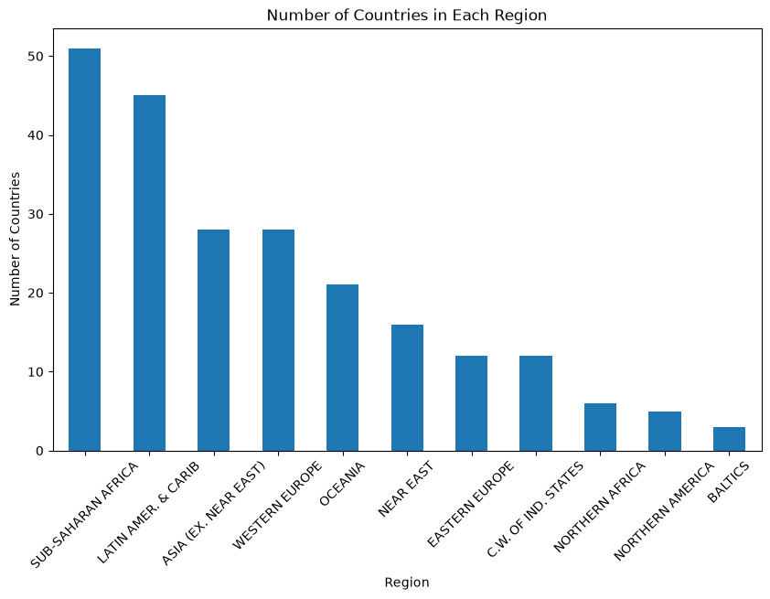

# NOD Coding Bootcamp

Codealongs and lab exercises from the NOD coding bootcamp: Python fundamentals,
data structures, string/list operations, functions, and pandas/data-viz labs
(`codealongs/`, `lab/`, organized by week and day).

